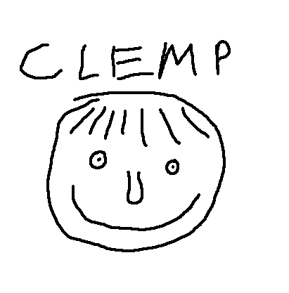

<p align="center">
  
</p>

A CLI tool for scaffolding [Claude Code](https://docs.anthropic.com/en/docs/claude-code) config files. It clones a repo and sets up the various files (CLAUDE.md, .mcp.json, .claude dir) depending on the arguments you give it.

After the initial setup, `clemp update` keeps your project in sync with template changes while preserving your customizations — conflicts are merged interactively using the `claude` CLI.

## Installation

With homebrew:
```bash
brew install bn-l/tap/clemp
```

Or cargo: clone this then:
```bash
cargo install --path .
```

## Usage

```bash
clemp [LANGUAGES]... [OPTIONS]        # initial setup
clemp update [LANGUAGES]... [OPTIONS] # pull template changes (additive)
clemp list [CATEGORY]                 # list available template files
```

On first run, you'll be prompted to provide a url to your repo. This is saved to `~/.config/clemp/clemp.yaml`.

After a successful `clemp` or `clemp update`, a `.clemp-lock.yaml` is written in the project root capturing the template repo, commit SHA, the invocation arguments, and hashes of every file clemp wrote.

### Examples

```bash
# Configure for a TypeScript project
clemp ts

# Multiple languages
clemp rust typescript

# With specific hooks and MCP servers
clemp python --hooks sound,lint --mcp context7,filesystem

# With clarg argument guard
clemp ts --clarg strict

# Pull in template updates (merges conflicts via Claude)
clemp update

# Update AND add a new MCP server (args are additive — nothing is removed)
clemp update --mcp postgres

# Overwrite everything without merging (destructive)
clemp update --force

# Prune files the template no longer produces, no prompt
clemp update --prune-stale

# Re-copy files you accidentally deleted
clemp update --restore-deleted

# List everything available in the template
clemp list

# List only available MCP servers
clemp list mcp
```

## Options

### `clemp` (initial setup)

| Option | Default | Description |
|--------|---------|-------------|
| `--hooks` | — | Hook names to include (comma or space separated) |
| `--mcp` | — | MCP server names to include (comma or space separated) |
| `--commands` | — | Command names to include (comma or space separated) |
| `--githooks` | — | Git hook scripts to install into `.git/hooks/` |
| `--clarg` | `default` (if present) | Clarg config profile to enable (see below) |
| `--force` | — | Overwrite existing files without prompting |

### `clemp update`

Same arguments as initial setup, plus:

| Option | Description |
|--------|-------------|
| `--prune-stale` | Delete files the template no longer produces without prompting |
| `--restore-deleted` | Re-copy clemp-tracked files you've removed from the working directory |
| `--force` | Skip interactive merge — overwrite conflicts with the template version |

## How `clemp update` works

`.clemp-lock.yaml` records the SHA of every file clemp wrote. On update, clemp clones the template again and classifies every file:

| Classification | Trigger | Action |
|----------------|---------|--------|
| **clean**       | On-disk hash matches lockfile | Overwrite with new template version |
| **new**         | New file in the template | Copy to project |
| **skipped**     | You modified it, template didn't | Leave your version alone |
| **conflict**    | You modified it AND template changed | Launch `claude --model sonnet` to merge interactively |
| **collision**   | Template introduced a path you already use | Route through Claude merge (or `--force`) |
| **stale**       | Template no longer produces it | Prompt to delete (or `--prune-stale` / keep) |
| **missing**     | Tracked file you deleted | Ignore (or `--restore-deleted` to re-add) |

### Merge conflicts

When a file you modified has also been changed in the template, clemp invokes `claude` in the current terminal with a prompt pointing to both the current file and the template's new version, asking it to merge while preserving your customizations. You approve each edit interactively.

If `claude` isn't on PATH, clemp exits with instructions — either install Claude Code, or re-run with `--force` to overwrite your edits with the template version.

## Clarg Integration

[clarg](https://github.com/bn-l/clarg) is a `PreToolUse` hook that blocks risky commands, arguments, and file access in Claude Code. clemp can set it up automatically.

### Setup

1. Add a `clarg/` directory to your template repo with YAML config files:

```
claude-template/
└── clarg/
    ├── default.yaml      # Auto-applied when present
    ├── strict.yaml
    └── permissive.yaml
```

Each YAML file is a clarg config (see [clarg docs](https://github.com/bn-l/clarg) for the schema):

```yaml
block_access_to:
  - ".env"
  - "*.secret"
commands_forbidden:
  - "rm -rf"
  - "sudo"
internal_access_only: true
```

2. If a `default.yaml` exists in the `clarg/` directory, it is applied automatically — no flag needed:

```bash
# default.yaml is applied automatically
clemp ts
```

To use a different config instead, pass it explicitly with `--clarg`:

```bash
# Uses strict.yaml instead of default.yaml
clemp ts --clarg strict
```

This copies the chosen YAML to `.claude/clarg-<name>.yaml` and registers a `PreToolUse` hook in `.claude/settings.local.json` that runs `clarg .claude/clarg-<name>.yaml`.

### Installing clarg

If clarg is not on your PATH, clemp will print install instructions:

```bash
brew install bn-l/tap/clarg
# or
cargo install --git https://github.com/bn-l/clarg
```

## Template Repository Structure

Your `claude-template` repo should contain:

```
claude-template/
├── CLAUDE.md.jinja               # MiniJinja template
├── .mcp.json                     # optional
├── gitignore-additions           # lines appended to project .gitignore
├── settings.local.json           # base settings merged by clemp
├── claude-md/
│   ├── lang-rules/
│   │   ├── typescript.md
│   │   └── ...
│   ├── mcp-rules/
│   │   └── context7.md
│   └── misc/                     # optional extra template sections
│       └── some-section.md[.jinja]
├── hooks/
│   ├── default/                  # always-on
│   │   └── sound.json
│   └── blocker.json              # opt-in via --hooks
├── mcp/
│   ├── default/                  # always-on
│   │   └── context7.json
│   ├── typescript/               # language-matched
│   │   └── ts-server.json
│   └── filesystem.json           # opt-in via --mcp
├── commands/
│   ├── default/                  # always-on
│   ├── typescript/               # language-matched
│   └── review.md                 # opt-in via --commands
├── skills/
│   ├── default/
│   └── typescript/
├── copied/                       # files copied to project root
│   ├── default/
│   └── typescript/
├── githooks/                     # installed to .git/hooks/
│   ├── default/
│   ├── typescript/
│   └── pre-push                  # opt-in via --githooks
└── clarg/                        # optional clarg configs
    ├── default.yaml              # Auto-applied if present
    └── strict.yaml
```

The `CLAUDE.md.jinja` uses [MiniJinja](https://github.com/mitsuhiko/minijinja) syntax with access to:
- `lang` — dict keyed by canonical language name (truthy-check with ``)
- `mcp` — dict keyed by active MCP server name
- `lang_rules` — rendered language rule sections
- `mcp_rules` — rendered MCP rule sections
- Dynamic variables from `claude-md/misc/<name>.md[.jinja]` (hyphens become underscores)
